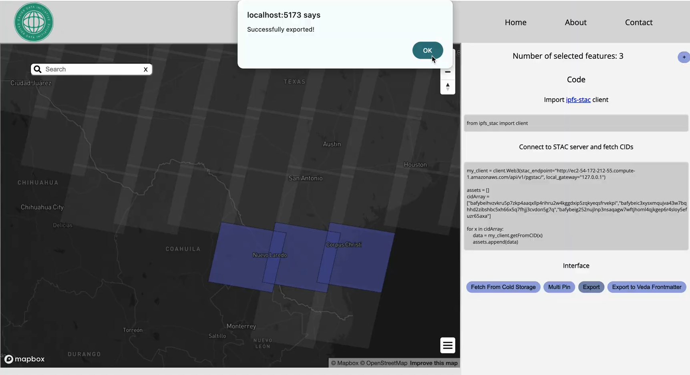
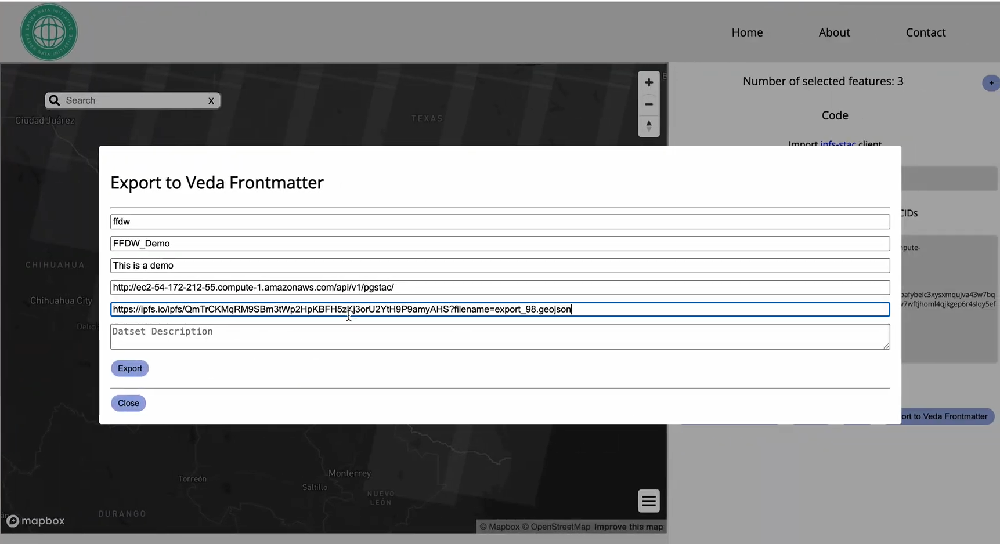
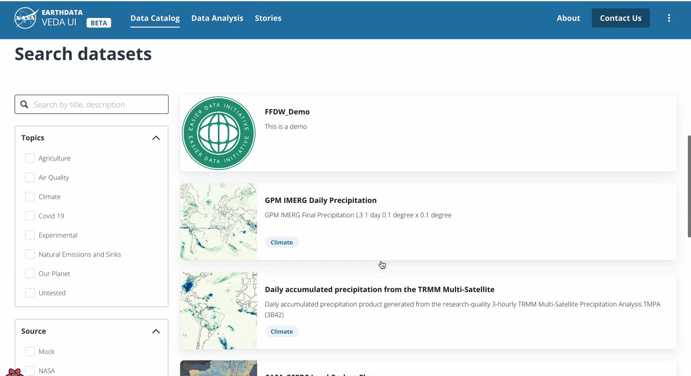

# Overview

One of the challenges faced when working with novel technology is the lack of integration with other traditional software, platforms, and projects during the early stages of adopting ecosystems such as IPFS and Filecoin. This post will highlight one case where the EASIER Data Initiative aims to build a bridge between IPFS and an existing software built by NASA, VEDA.

The Visualization, Exploration, and Data Analysis (VEDA) project by NASA is an infrastructure project built by NASA Earthdata to support various datasets' processing, visualization, and exploration capabilities. One of the project's goals is to curate a collaborative environment for GIS. To learn more about VEDA, check out [this link](https://www.earthdata.nasa.gov/data/tools/veda) and their [Github repository](https://github.com/NASA-IMPACT/veda-ui) for VEDA UI.

One of our core projects at EASIER is the Geospatial Dashboard. We have already shown this project under the spotlight. If interested, you can catch up to speed through this blog post ([Dashboard Showcase](https://easierdata.org/updates/2024/2024-01-24-dashboard-showcase)). On a high level, the Geospatial Dashboard allows users (scientists, researchers, etc) to link our custom web app interface to read data from a Web3-enriched spatiotemporal asset catalog (STAC) API and Geojson geometry to render a map. The interactive map assists users with exploring the high-level metadata associated with the features loaded onto the STAC API. Lastly, the dashboard couples seamlessly with IPFS through direct communication to nodes through the [Kubo RPC API](https://docs.ipfs.tech/reference/kubo/rpc/). Leveraging the API, the dashboard can pin data, add assets to the mutable file system (MFS), and more.

One of the latest additions to the project is the ability to quickly export data to a NASA VEDA instance by generating [frontmatter](https://jekyllrb.com/docs/front-matter/). Frontmatter are markdown files that pose as the skeleton for a dataset within a VEDA catalog. They define any titles, descriptions, links, and other helpful facets of a dataset to be rendered on the VEDA app. With this, we are one step closer to bringing the decentralized web into projects that rely on traditional infrastructure. The rest of this post will walk through an example of getting an export into the VEDA UI repo hosted locally.

# Walk Through

## Getting Veda UI To Run

The first step of this demo is to get an instance of VEDA UI running locally. Clone the VEDA UI **[Github repository](https://github.com/NASA-IMPACT/veda-ui) to get started. Note that prerequisites include:

1. [NodeJS](https://nodejs.org/en)
2. [Yarn](https://classic.yarnpkg.com/lang/en/docs/install/)

Once everything has been installed, navigate to the root directory of the VEDA UI project and run ``yarn install`` to pull down all the dependencies. Follow this by running ``yarn serve``, which will begin hosting the dashboard locally.

The terminal should look similar to what is shown above

## Create frontmatter

Next, on the Geospatial Dashboard select scenes of interest by holding shift and drag clicking to create a bounding box around scenes of interest. A panel to the right will render, click on **Export** to get the data loaded on the configured IPFS node's MFS through our Chrome extension.

Then, click **Export to Veda frontmatter** and fill out all the fields. The Dataset endpoint refers to where the data can be accessed/retrieved. Since we exported the data to our IPFS node's MFS, we can copy the ipfs.io link to access the CID and insert it there.

Once the form has been filled, click on export to download an MDX file suitable for VEDA!

## Load the Data to Veda UI Instance

To get the frontmatter loaded to the VEDA UI instance, simply drag the MDX file downloaded to the datasets folder from which the dashboard reads. If you're running the instance pulled from Github, it would be found at ``/mock/datasets``

# End/Closing Remarks

Once the MDX folder has been uploaded, you will see the VEDA UI instance running hot reload to render the frontmatter we generated!

By integrating IPFS into software such as VEDA, we're setting the stage for other teams and developers to continue leveraging decentralized infrastructure in their geospatial workflows. The workflow outlined in this post--creating frontmatter for data stored on IPFS--illustrates how creating pipelines that connect the dots is possible. This integration is just the beginning of more capabilities from our team.

This demonstration embarks the beginning of intertwining both the traditional geospatial web and decentralized technology. Keep your eye out as the EASIER team continues to build on top of this foundation. One key milestone that has been under the team's radar is leveraging VEDA's interactive visualization functionalities to render geospatial data stored on IPFS.